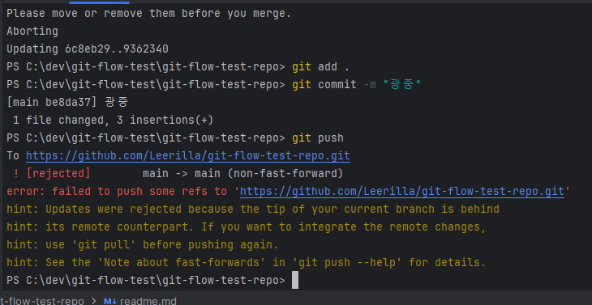
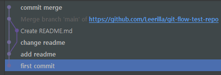

# git flow 전략

## 충돌 해결
1. git commit 시 충돌이 발생하면 아래와 같은 오류가 발생된다.

위 오류의 원인은 원격 브랜치의 commit 분기와 로컬 브랜치의 commit 분기가 맞지 않아서 발생한다.
 
오류를 해결하기 위해서는 다음과 같이 진행한다.
1. git pull origin main
2. git add . 
3. git commit -m "commit message"
4. git push

